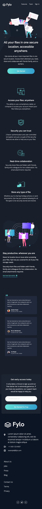

# Frontend Mentor - Fylo dark theme landing page solution

This is a solution to the [Fylo dark theme landing page challenge on Frontend Mentor](https://www.frontendmentor.io/challenges/fylo-dark-theme-landing-page-5ca5f2d21e82137ec91a50fd).

## Overview

### The challenge

Users should be able to:

- View the optimal layout for the site depending on their device's screen size
- See hover states for all interactive elements on the page
- Receive an error message when the `form` is submitted if:
  - The email address is not formatted correctly
  - The `input` field is empty

### Screenshot

### Built with

- Gulp
- Semantic HTML5 markup
- SASS/SCSS
- Flexbox
- JavaScript
- Mobile-first workflow